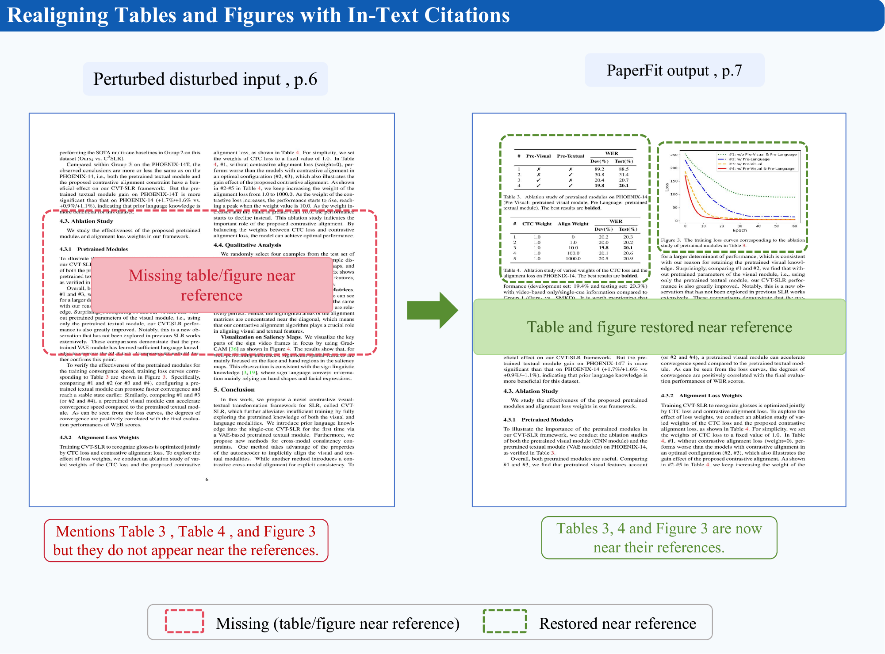
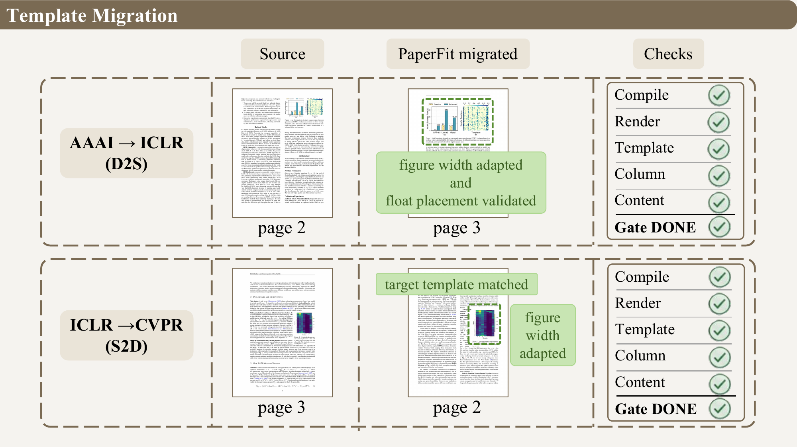

<a id="top"></a>

<div align="center">


# PaperFit

**Vision-in-the-Loop Academic Typesetting Agent System**

PaperFit 是面向 `Claude Code`、`Codex`、`Cursor` 的 LaTeX 论文排版 Agent System。你只需要在论文项目根目录描述目标，PaperFit 会自动完成编译、页图渲染、视觉诊断、源码修复与最终验收。

<p>
  
  
  
  
  
</p>

<p>
  <a href="#为什么需要-paperfit"><b>为什么需要</b></a> ·
  <a href="#核心能力"><b>核心能力</b></a> ·
  <a href="#真实效果展示"><b>效果展示</b></a> ·
  <a href="#快速开始"><b>快速开始</b></a> ·
  <a href="#安装"><b>安装</b></a> ·
  <a href="#使用方法"><b>使用方法</b></a> ·
  <a href="#工作流"><b>工作流</b></a> ·
  <a href="#架构"><b>架构</b></a>
</p>

</div>

---

## 为什么需要 PaperFit

论文的 LaTeX 编译通过，并不代表版面已经合格。真实投稿前常见的问题往往发生在视觉层面：浮动体堆在一起、双栏页面出现大面积空洞、表格风格不一致、公式或表格溢出、模板迁移后对象位置失控。这些问题很难只靠 `.log` 文件发现，也很难靠一次性文本改写稳定解决。

PaperFit 把论文排版视为一个视觉闭环任务：先把 PDF 渲染成页面图像，再结合 LaTeX 日志、交叉引用和模板规则判断问题，最后回写源码并重新渲染验收。它的目标不是替代作者写论文，而是把“看版面、修源码、再检查”的重复劳动交给 Agent。

| 传统方式 | PaperFit |
|------|------|
| 主要关注编译错误 | 同时关注编译、视觉版面和内容完整性 |
| 人工翻 PDF 找问题 | 页图渲染后按缺陷类型系统诊断 |
| 手动调整浮动体和表格 | 由 Agent 生成修复策略并受控改源码 |
| 模板迁移后逐页救火 | 将模板规则、栏型、浮动体和表格一起处理 |
| 修完后靠肉眼确认 | 用视觉门禁决定继续修复还是交付 |

## 核心能力

| 能力 | 说明 |
|------|------|
| **视觉排版诊断** | 识别孤行、末页留白、双栏空洞、浮动体堆积、表格不一致、溢出与对齐问题。 |
| **完整 VTO 修复** | 串联编译、日志解析、页图渲染、视觉诊断、源码修复与复验。 |
| **模板迁移** | 支持 CVPR、ICLR、ACL、ACM 等常见学术模板之间的迁移与版式重整。 |
| **页数控制** | 在目标页数预算下优先做版式级调整，必要时进行最小、可审计的语义微调。 |
| **局部对象修复** | 针对单个表格、图、公式或页面问题执行更小范围的修复。 |
| **跨宿主分发** | 同一套能力可安装到 `Claude Code`、`Codex`、`Cursor`。 |

## 真实效果展示

下面的案例来自 PaperFit 的真实排版修复效果展示。

<p align="center">
  <a href="images/case1.pdf">
    
  </a>
</p>

<p align="center">
  <a href="images/case2.pdf">
    
  </a>
</p>

## 适合场景

- 投稿前检查论文是否存在明显视觉排版缺陷。
- 将已有论文迁移到新的会议模板，并尽量保持内容和对象稳定。
- 把正文压缩到目标页数，同时尽量不改变学术含义。
- 修复宽表、浮动体堆叠、双栏空洞、overfull、caption 不一致等问题。
- 在 Agent 宿主中用自然语言发起排版任务，而不是手动串脚本。

## 快速开始

安装完成后，在论文项目根目录直接对宿主说目标即可：

```text
用 PaperFit 分析这篇论文的排版问题
```

```text
Use the paperfit agent to inspect this paper's layout and tell me the main visual defects
```

```text
用 PaperFit 把这篇论文迁移到 CVPR 模板，并尽量保持图表和引用稳定
```

```text
用 PaperFit 把正文压到 8 页，尽量不要改学术内容
```

PaperFit 会自动推断主 `.tex` 文件、当前模板、页面预算和需要进入的修复路径。只有在项目结构不清楚、环境缺失或目标本身有歧义时，它才需要你补充信息。

## 安装

### 环境要求

- Node.js `18+`
- Python `3.8+`
- Poppler：用于 PDF 信息读取和页图渲染
- LaTeX 编译环境：如 `tectonic`、`pdflatex` 或模板要求的工具链

macOS 上可安装 Poppler：

```bash
brew install poppler
```

### npm 安装

```bash
npm install -g paperfit-cli
paperfit-install --target claude
```

也可以安装到其他宿主：

```bash
paperfit-install --target codex
paperfit-install --target cursor --project /path/to/paper
paperfit-install --target all
```

安装后建议运行一次体检，并安装 Python 依赖：

```bash
paperfit doctor --target claude
pip3 install -r "$(npm root -g)/paperfit-cli/requirements.txt"
```

### 从源码安装

```bash
git clone https://github.com/OpenRaiser/PaperFit.git
cd PaperFit
npm install
bash install.sh --local --target claude
```

Claude Code 插件市场安装：

```text
/plugin marketplace add OpenRaiser/PaperFit
/plugin install paperfit@paperfit-vto
```

Codex provider 相关说明见 [docs/CODEX_PROVIDER_SETUP.md](docs/CODEX_PROVIDER_SETUP.md)。

## 使用方法

PaperFit 的推荐入口是自然语言，而不是记忆内部命令。

| 宿主 | 推荐入口 |
|------|------|
| `Claude Code` | `/paperfit` 后描述排版目标；也可使用 `/fix-layout`、`/check-visual`、`/repair-table` 等快捷命令。 |
| `Codex` | 明确请求 `Use the paperfit agent to ...`，之后可通过 `/agent` 切回已创建的 PaperFit agent 线程。 |
| `Cursor` | 在论文项目中描述任务，项目级 rule 会引导 Cursor 调用 PaperFit 能力。 |

常见任务：

| 任务 | 示例 |
|------|------|
| 排版分析 | `用 PaperFit 分析 main.tex 的视觉排版问题` |
| 完整修复 | `Use the paperfit agent to run a full layout repair loop` |
| 视觉检查 | `Use PaperFit for visual inspection only` |
| 表格修复 | `用 PaperFit 修复这个跨栏表格，不要用 resizebox 硬压缩` |
| 模板迁移 | `用 PaperFit 把这篇论文迁移到 CVPR 模板` |
| 长度调整 | `用 PaperFit 把正文压到 8 页，语义修改要最小` |
| 状态查看 | `Use the paperfit agent to summarize the current layout status` |

## 工作流

PaperFit 的闭环可以概括为：

```text
LaTeX project
  -> compile and parse logs
  -> render PDF pages
  -> diagnose visual defects
  -> plan source-level repairs
  -> patch LaTeX safely
  -> recompile and rerender
  -> gatekeeper acceptance
```

视觉检查是交付前的必要步骤。PaperFit 不会只因为编译通过就宣称排版完成，也不会为了压缩页数静默删除 figure、table、caption、label 或交叉引用。

## VTO 缺陷分类

PaperFit 使用 Visual Typesetting Optimization (VTO) taxonomy 来统一诊断和修复语言：

| 类别 | 关注问题 |
|------|------|
| **A 空间利用** | 孤行、寡行、末页留白、双栏高度失衡、页面大空洞。 |
| **B 浮动体** | 图表位置、尺寸、堆叠、跨栏与正文关系。 |
| **C 一致性** | 表格、图表、caption、间距、风格不统一。 |
| **D 溢出与对齐** | overfull、公式断行、表格超宽、对象边界错位。 |
| **E 模板迁移** | 单双栏变化、宏包兼容、会议模板规则差异。 |

完整定义见 [config/vto_taxonomy.yaml](config/vto_taxonomy.yaml)。

## 架构

PaperFit 由 Agent 角色、技能包、配置和执行层组成。Agent 负责判断任务和组织闭环；CLI 与脚本负责渲染、状态记录、日志解析和可重复执行的修复动作。

| 组件 | 职责 |
|------|------|
| `agents/` | 调度、视觉诊断、规则检查、源码修复、语义微调、质量门禁的角色说明。 |
| `skills/` | VTO taxonomy、视觉检查、浮动体优化、溢出修复、模板迁移、写作微调等能力说明。 |
| `config/` | 模板元数据、版式规则、Agent 角色、写作边界和缺陷分类配置。 |
| `scripts/` | PDF 渲染、日志解析、视觉信号聚合、状态管理、修复执行和门禁检查。 |
| `bin/paperfit.js` | `paperfit` CLI 入口，供安装、体检、渲染和内部执行调用。 |

简化目录：

```text
PaperFit/
├── agents/                 # Agent role definitions
├── skills/                 # PaperFit capability bundle
├── config/                 # templates, layout rules, taxonomy
├── scripts/                # render, inspect, repair, gatekeeper
├── plugins/paperfit/       # Codex plugin assets
├── .claude/commands/       # Claude Code commands
├── bin/paperfit.js         # CLI entry
├── install.sh
└── README.md
```

## 开发与验证

在仓库根目录准备开发环境：

```bash
npm install
python3 -m venv .venv
source .venv/bin/activate
pip install -r requirements.txt
```

运行基础验证：

```bash
npm run verify
```

常用开发命令：

```bash
paperfit doctor --target claude
paperfit render paper.pdf --output data/pages
paperfit status
```

更多安装和命令细节见：

- [docs/COMMANDS_SETUP.md](docs/COMMANDS_SETUP.md)
- [docs/RELEASE_AND_LOCAL_UPDATE.md](docs/RELEASE_AND_LOCAL_UPDATE.md)
- [.claude-plugin/README.md](.claude-plugin/README.md)

## 内容保护

PaperFit 的自动修复必须保护学术内容和关键对象：

- 不静默删除 figure、table、caption、label、引用或实验结果。
- 不用 `\resizebox`、`\scalebox` 作为默认的表格压缩手段。
- 优先使用 `table*`、`tabularx`、列宽重构、浮动体重排等版式级方案。
- 语义编辑必须最小、可审计，并保留修复依据。

相关协议见 [protocols/content-integrity-protection.md](protocols/content-integrity-protection.md)。

## 许可证

MIT 许可证，见 [LICENSE](LICENSE)。
